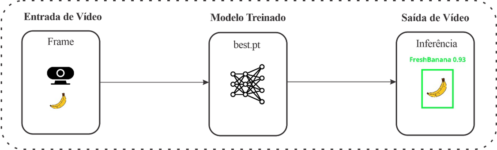
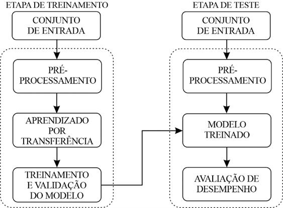
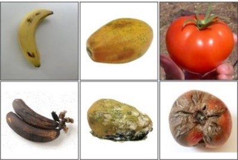
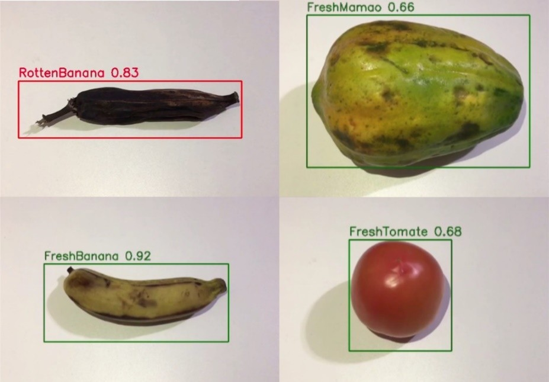

# 🍎🍌 Triagem de Alimentos Próprios e Impróprios para Consumo Humano

### Sistema baseado em YOLOv10 e Visão Computacional para auxiliar projetos sociais na triagem automática de alimentos.



*Figura 1. Funcionamento geral do sistema proposto.*

## 📖 Sobre o Projeto

O desperdício de alimentos representa um dos principais desafios relacionados à segurança alimentar. Em contrapartida, milhares de pessoas ainda dependem de projetos sociais que realizam a coleta e distribuição de alimentos doados.

Durante essas iniciativas, a etapa de triagem é normalmente realizada de forma manual, exigindo a inspeção individual de frutas e legumes para separar aqueles próprios dos impróprios para consumo humano. Esse processo demanda tempo, esforço humano e está sujeito a falhas.

Este projeto apresenta uma solução baseada em Inteligência Artificial e Visão Computacional capaz de automatizar essa etapa utilizando o modelo **YOLOv10**, permitindo identificar alimentos em tempo real e auxiliar equipes responsáveis pela triagem, contribuindo para a redução do desperdício de alimentos e para maior eficiência em projetos sociais.

## 🎯 Objetivo

Desenvolver um sistema baseado em Redes Neurais Convolucionais (CNN) para detectar automaticamente alimentos próprios e impróprios para consumo humano, auxiliando o processo de triagem por meio de técnicas de Visão Computacional e Aprendizado por Transferência.

## 🧠 Metodologia

O método proposto utiliza **Transfer Learning** sobre o modelo **YOLOv10n**, realizando um novo treinamento a partir de um conjunto de dados montado especificamente para esta pesquisa.

O sistema recebe imagens ou vídeo em tempo real, realiza a detecção dos alimentos presentes na cena e classifica automaticamente cada objeto conforme sua condição para consumo.



*Figura 2. Diagrama em blocos da metodologia proposta.*

## 📂 Dataset

Para atender aos objetivos da pesquisa foi desenvolvido um conjunto de dados denominado **Screening of Fresh and Rotten**, composto por imagens coletadas em diferentes fontes e posteriormente anotadas para treinamento do modelo.

### Características

- 2.886 imagens
- 6 classes
- Divisão: 80% Treino | 10% Validação | 10% Teste

### Classes

- 🍌 Fresh Banana
- 🍌 Rotten Banana
- 🥭 Fresh Papaya
- 🥭 Rotten Papaya
- 🍅 Fresh Tomato
- 🍅 Rotten Tomato

### Fontes das imagens

- Kaggle
- Google Images
- Roboflow
- Flickr
- Yandex Images



*Figura 3. Amostras do conjunto de dados utilizado.*

## ⚙️ Modelo Utilizado

### Arquitetura

- YOLOv10n

### Configuração do treinamento

- Transfer Learning
- 30 épocas
- Batch Size = 32
- Entrada = 640 × 640 pixels

## 📊 Resultados

O modelo apresentou desempenho satisfatório na classificação de alimentos próprios e impróprios para consumo humano, demonstrando viabilidade para aplicações reais em processos de triagem.

| Métrica | Valor |
|---------|------:|
| Precisão Geral | **90,2%** |
| mAP@50 | **92,8%** |
| mAP50-95 | **80,6%** |



*Figura 4. Amostras das inferências com alimentos reais.*

## ▶ Funcionamento

Fluxo de processamento:

```
     Aquisição de frame de vídeo
                ↓
         Pré-processamento
                ↓
          Modelo treinado
                ↓
      Detecção e Classificação
                ↓
          Bounding Boxes
                ↓
      Resultado em Tempo Real
```

---

# 💻 Tecnologias Utilizadas

- Python
- OpenCV
- Ultralytics YOLOv10
- PyTorch
- Google Colab

---

# 📁 Estrutura do Projeto

```text
Screening_of_Fresh_and_Rotten/

├── data/
├── images/
│   ├── amostras_dataset.jpg
│   ├── Diagrama_metodo.png
│   ├── funcionamento.png
│   └── resultado.jpg
│
├── README.md
├── data.yaml
└── best.pt
```

---

# 🌍 Aplicações

Este sistema pode ser empregado em diferentes cenários que envolvem a triagem de alimentos, como:

- 🍎 Projetos sociais de distribuição de alimentos
- 🤝 Bancos de alimentos
- 🚚 Centrais de triagem
- 🥬 Cooperativas agrícolas
- 🛒 Supermercados
- 📦 Centrais de abastecimento
- 🌱 Pesquisas em Visão Computacional aplicada à segurança alimentar
